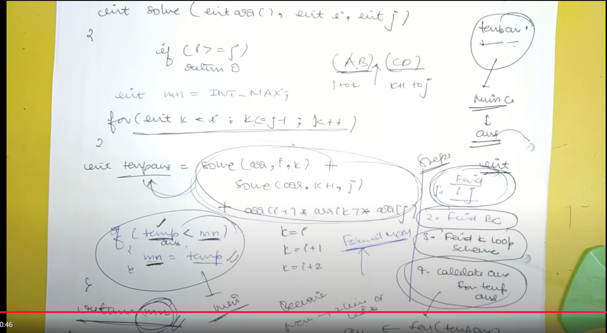

# Contents

## Recursion

>- choice/ Tree diagram  _ most important
- be clear about what you want to return from the function, if func. isn't void  
- break into smaller sub-problems and operate on them  
- suppose that the sub-problem will bring the answer

- base condition _ think of smallest valid input  
- generally we start from the last index, but sometimes we may need to start from starting index
- use (idx-1) inside rec function for getting array values, when calling on idx; first call will be on n, so it will access n-1 index
- when we call on rec

DP
- the no. of variables changing in the recursion, determine if dp[] array will be 1d, 2d, or 3d

## To identify type of DP

- Match I/P (given data) & O/P (ans) format/ data type
- 

## knapsack

- 0/1 knapsack _ starting from last, once an item is processed we will move to i-1
- unbounded knapsack _ we can take an item again, so even after taking we will still be at i

rod cutting is simply same as unbounded knapsack

### Coin change (max no. of ways) _ initialization

### Coin change (min no. of coins) _ unbounded knapsack
> - only question where will initialization is a bit different
- initialization with Int_MAX -1
- first two rows will be initialized  

Second Base condition
- 

## LCS - longest common subsequence

## Longest common substring - LCSS
- for substring, the else condition of subsequence will be zero

## print LCS

### SCS -  shortest common supersequene
m + n - lcs(a,b,m,n);   // a = string of length m; b = string of length n

### min insert. and del. to convert String A to string B

### LPS - longest palindromic subsequence

### Minimum number of deletion in a string to make it a palindrome

### print SCS

### longest repeating subsequence
- we take only those where i != j, this is the only change in LCS code

### sequence pattern matching
- given two strings, check if one of them lies in the other
- solution: compare length of lcs with min. of length of both strings

### min. no. of insertion to make it palindrome

## MCM - Matrix Chain Multiplication

### MCM Contents

### Matrix chain multiplication Introduction Identification and General Format
generally used when we have to partition/ do something k times between i & j

### MCM recursive
contains 4 steps to make problem specific code

### Palindrome Partition _ min partitions required to make it a palindrome

optimised
- 

### Boolean Parenthesization

- here as we were having 3 changing variables, we chose to use hashmap instead of 3d array 

### Scrambled string

- substr in c++, takes starting index and length as arguments
- in java, it's starting index and ending index

### Egg Drop

- optimised & memoized code  
    

## DP on Trees
- base condition
- hypotheses _ believe it will give the answer
- induction step

### Diameter of binary tree _ max number of nodes between two leaf nodes

### Max path sum _ any node to any node
- this step is required in case, we get negative values from left and right subtree     

### Max path sum _ leaf node to leaf node
in this case, if both subtrees give negative value, it has to take the negative also 
